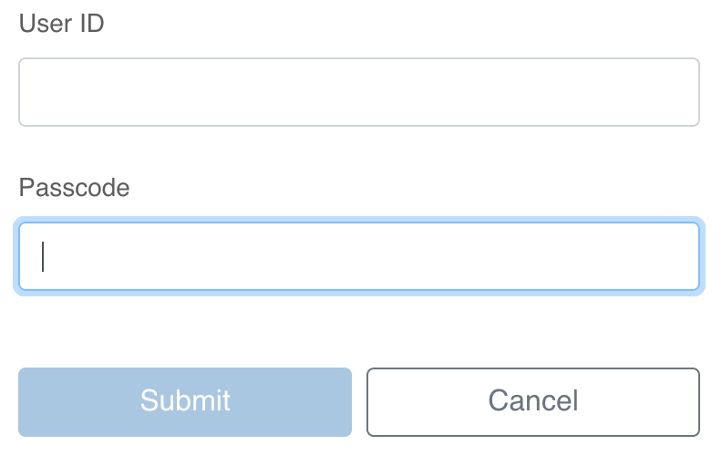

# SecureID Tab Order

A Firefox addon which corrects the tab index on the SecurID login page.



Using the keyboard to navigate from the User ID input field to the Passcode input field on SecurID login pages usually
takes two tab key presses.
This extension removes a hidden input from the tab index, which allows you to complete this navigation using one tab key
press.

## Install from source

1.  Package the extension.

    ```bash
    ./build.sh
    ```

1.  Follow [Mozilla's instructions](https://support.mozilla.org/en-US/kb/add-on-signing-in-firefox?as=u&utm_source=inproduct#w_where-would-i-encounter-unsigned-add-ons)
    for installing unsigned addons to install the packaged extension, located in the _build_ folder.
