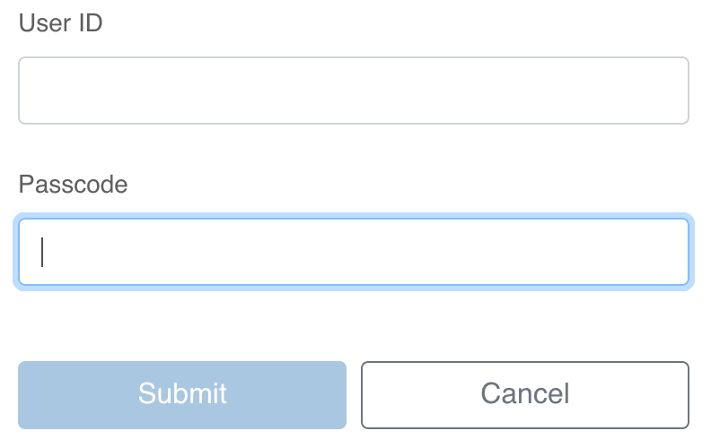

# SecureID Tab Order

A browser extension which corrects the tab index on the SecurID login page.

## Install

[](https://addons.mozilla.org/en-US/firefox/addon/securid-tab-order/)

## About



Using the keyboard to navigate from the User ID input field to the Passcode input field on SecurID login pages usually
takes two tab key presses.
This extension removes a hidden input from the tab index, which allows you to complete this navigation using one tab key
press.

## Install on Chrome from source

1.  Navigate to [chrome://extensions](chrome://extensions). 

1.  Click the toggle to enable _Developer Mode_.

1.  Click the _Load unpacked_ button and load the extension directory.

## Install on Firefox from source

1.  Package the extension.

    ```bash
    ./build.sh
    ```

1.  Follow [Mozilla's instructions](https://support.mozilla.org/en-US/kb/add-on-signing-in-firefox?as=u&utm_source=inproduct#w_where-would-i-encounter-unsigned-add-ons)
    for installing unsigned addons to install the packaged extension, located at _build/securid-tab-order@gern.org.xpi_.
